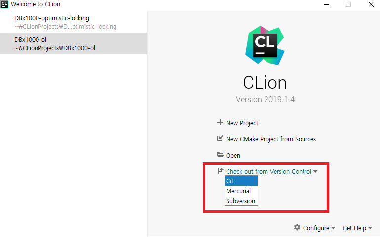
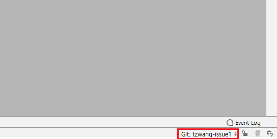
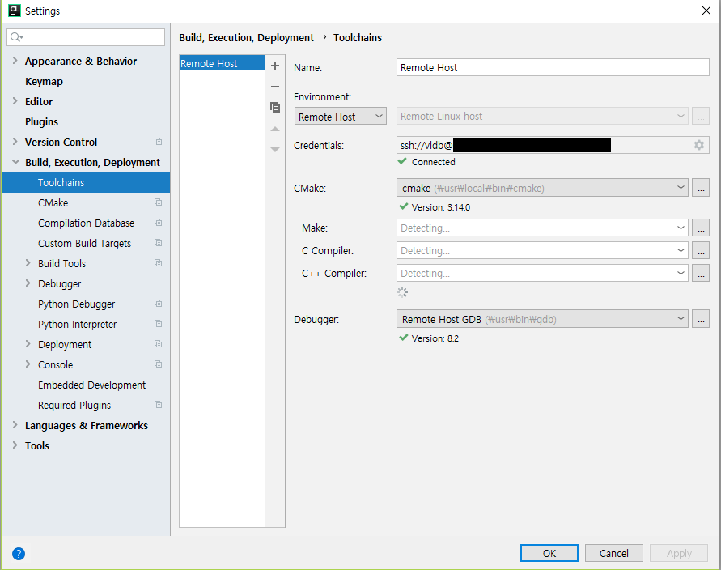
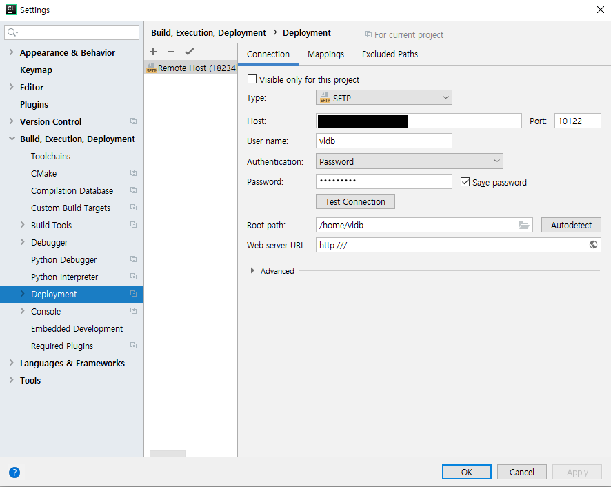
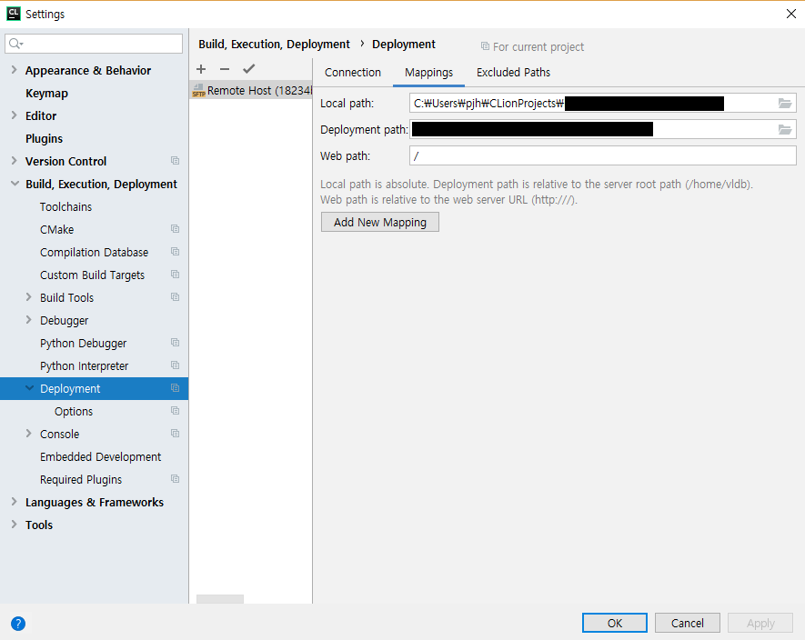
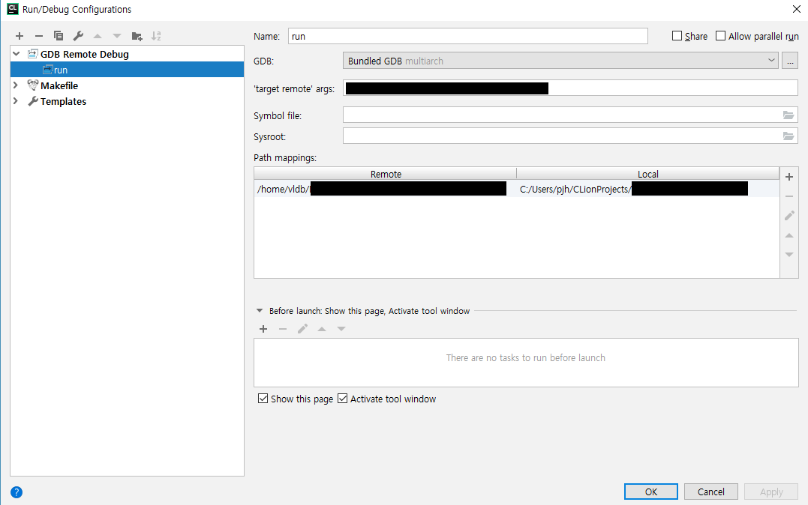
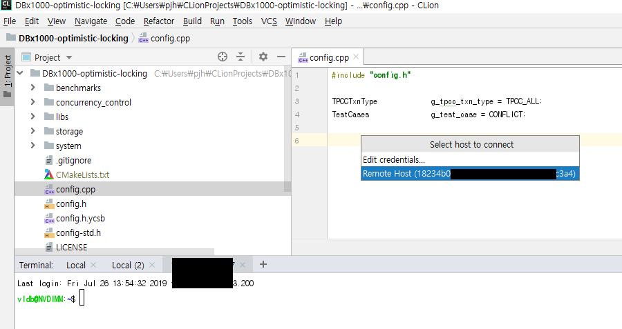
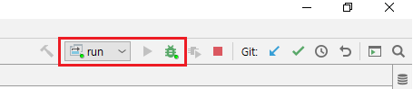

# Remote Debugging with CLion
> Jetbrains사에서 제공하는 CLion IDE를 활용하여 효율적으로 디버깅할 수 있는 환경설정 방법에 대해 다룬다.  

## Prefacce
```
C/C++ 프로젝트를 수행 중에 예상치 못한 버그를 만나는 경우, GDB (GNU Debugger)를 통해 버그가 발생한 지점 (예: Segment Fault, Core Dump 등)을 찾고 고친다. 
하지만 기본적으로 Linux 시스템에서 제공하는 터미널에서 GDB를 하는 경우, 가독성이 좋지 않고 간단한 연산 작업 (메모리 주소값 확인, 메모리 주소가 가르키는 값, 조건문 확인 등)을 하기 위해 해당 변수의 이름이나 명령어를 직접 입력해야된다. 
특히, breakpoint를 설정하기 위해서는 해당 함수이름 또는 파일위치+라인을 직접 입력해줘야하며 C++ 프로젝트의 경우, 오버로딩된 함수등을 제어하기 힘들다.

Window나 Mac 환경에서 IDE를 활용하여 개발하는 경우 내장된 Debugger를 통해 쉽게 디버깅을 할 수 있는 장점이 있다. 하지만, Linux에 있는 개발서버의 프로젝트는 라이브러리 의존성 등의 문제로 컴파일의 어려움이 있고, 실제로 실험 또는 Release를 하는 환경과 다른 경우 예상치 못한 문제를 겪을 수 있다. 이를 해결하기 위해, CLion은 Full-Remote 모드를 제공하며, IDE에서 원격 서버에 있는 프로젝트의 컴파일과 디버깅을 할 수 있다. 하지만 CMake 프로젝트에 대해서만 제공하는 문제가 있다. (CMake 프로젝트가 아닌경우, 상당히 어렵다.)

본 장에서는 원격 서버에 있는 C/C++ 프로젝트를 원격에서 컴파일 및 실행하면서 디버깅만 CLion에서 할수 있도록 환경설정에 대해 설명한다.
```

## Prerequsite
* [CLion](https://www.jetbrains.com/clion/download/) 
    - 유료 IDE이지만, **학생은 무료이다.** (학교 메일로 인증하면됨.)
* 외부 포트가 개방된 리눅스 서버
    - 실제로 디버깅할 프로젝트가 **컴파일**할 수 있는 환경의 서버
* C/C++로 개발된 프로젝트  (버그가 가득한 프로젝트 )  

## Setup

### GitHub과 연동하기  *optional*
- 
- 처음 CLion을 열면 프로젝트를 생성 또는 기존 프로젝트를 가져오기 화면이 나온다. 
이때 **Check out from Version Control** 메뉴를 누르고, **Git**을 선택한다. 
- GitHub 계정으로 로그인한 다음 Repository에 있는 프로젝트를 import한 후 작업할 수 있다.
- 특정 branch 가져오는 방법
    - GitHub에 있는 프로젝트를 import 경우, clion 우측 하단의 메뉴를 보면 branch를 선택할 수 있다. 
    - branch를 선택하면, CLion workspace에 local branch를 생성한 후 작업을 할 수 있다.
    - 

### 개발 서버와 연동하기
1. Toolchain 설정
    - 
    - `File->Setting` => `Build, Execution, Deployment` => `Toolchains` 메뉴
    - 원격 개발 서버 SSH 연결을 설정해준다. 이때 포트 번호도 함께 입력한다. 
        ~~~
        ssh://vldb@111.111.111.111:22
        ~~~
    - 자동으로 원격 개발 서버의 C/C++ compiler 및 Make, Cmake binary를 확인함.

2. Deployment 설정
    - 
    - 원격 개발서버와의 ssh 연결 정보를 입력한다.
    - 원격 개발 서버에 있는 프로젝트의 경로와, 현재 로컬 경로에 대한 mapping을 설정한다.
        - 
        - `Deployment path`에 원격 개발서버의 프로젝트 경로를 입력한다.

3. Remote GDB server 설정
    - 
    - `Run->Edit Configuratinos` 메뉴에서 우측 상단의 **+** 버튼 클릭
    - `GDB Remote debug` 템플릿 선택 
        - target remote args 항목에 원격서버 IP주소와 gdbserver연결용 port를 함께 입력
            ~~~c++
            111.111.111.111:10023 /* ssh port와 달라야함. */
            ~~~
        - path mapping 항목에서 `Remote`에는 원격 개발서버의 프로젝트 경로를 입력하고, `Local`에는 로컬 경로를 입력한다.

4. Remote ssh 세션
    - `Tools->Start SSH Sessions` 클릭
    - 기 설정한 Remote Host 세션 클릭
        - 


### How to Debug
1. 원격 개발 서버에서 `gdbserver` 실행
    - 원격 ssh 세션 Open
    - `gdbserver` 실행
    ~~~c++
    gdbserver :port [program name]
    ~~~
2. CLion에서 Debug 실행
    - Breakpoint를 설정하거나 디버깅 옵션들을 설정한 후, 디버그 버튼 클릭. :beetle:
    - 


### Trick  
- 자동 컴파일 하기
- 파일 싱크 맞추기

## 참고
- [CLion Start Guide](https://www.jetbrains.com/help/clion/clion-quick-start-guide.html)

## Acknowledgement
- Thanks to [Hyojin Kim](https://github.com/KimHyoJin) 